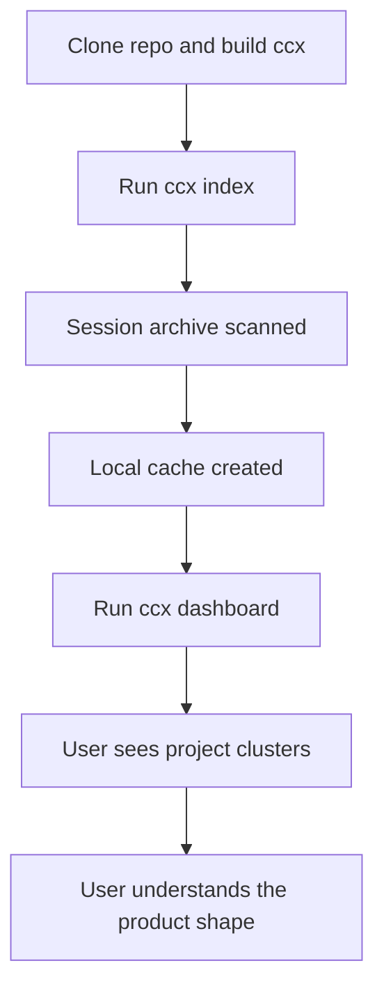
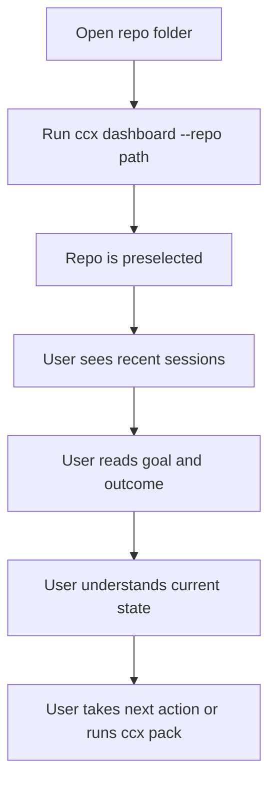
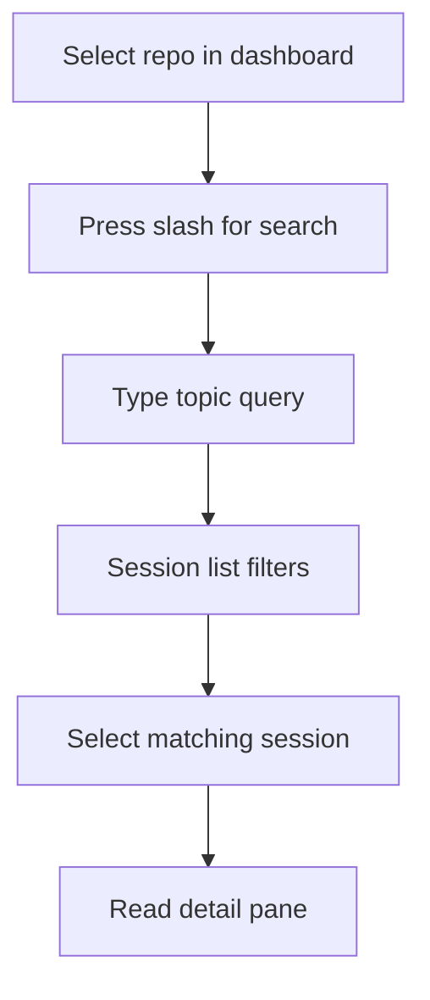
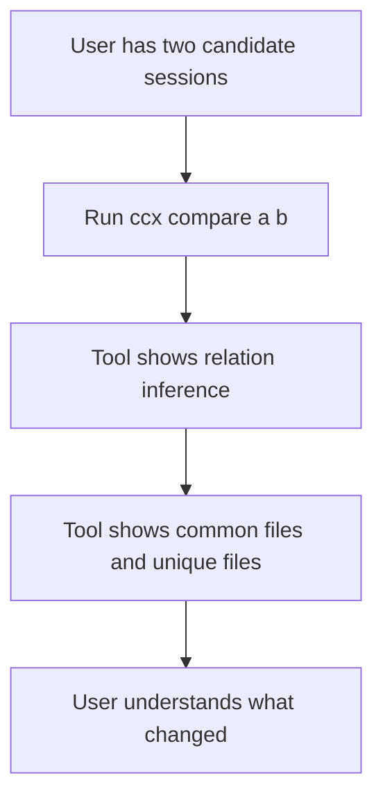
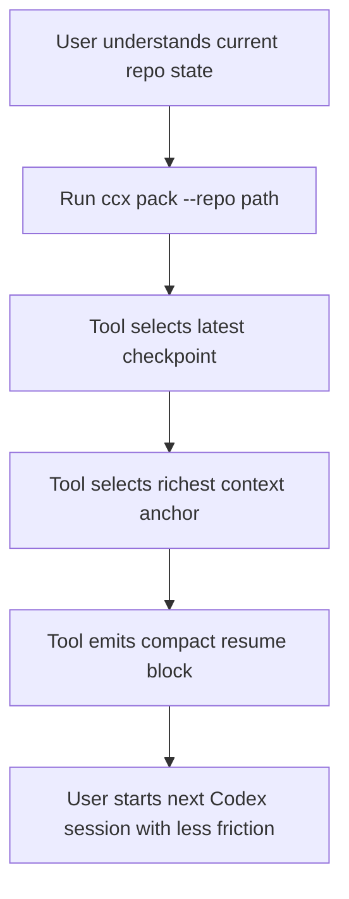

# User Flows

Last updated: 2026-04-10

This document describes the main user journeys for Codex Continuity OS.

## Flow 1: First Run

Goal: user builds trust that the tool can see and organize their Codex history.

Success criteria:

- the index completes
- the dashboard opens
- the user sees recognizable repos/projects

## Flow 2: Resume A Repo After A Break

Goal: user recovers the right project context quickly.

Success criteria:

- correct repo is selected
- the best session is obvious
- the user can name the next action without reopening old chats manually

## Flow 3: Find The Chat About A Topic

Goal: user recovers a session by topic, not by memory of session id.

Success criteria:

- user finds the correct session quickly
- filtered results feel clearly related to the query

## Flow 4: Compare Two Sessions

Goal: user understands whether two chats belong to the same continuity chain.

Success criteria:

- relation is clear
- overlap and deltas are useful
- user can identify the later checkpoint

## Flow 5: Build Resume Pack For The Next Chat

Goal: user hands the next Codex session the right compact context.

Success criteria:

- pack feels compact
- files listed are actually relevant
- the suggested prompt is usable immediately

## Current UX Weakness In The Flows

The weakest part today is not the flow shape. It is the summary quality inside the flow.

That means:

- Flow 2 suffers when the selected session’s `goal` and `outcome` are shallow
- Flow 3 suffers when topic matching is correct but the displayed summary is weak
- Flow 5 suffers when the “best continuity summary” is only the last assistant reply

So the biggest leverage point is still:

- stronger whole-chat summarization

## Preferred Product Narrative

The product should increasingly feel like this:

1. open dashboard
2. pick project
3. inspect best session
4. search or compare if needed
5. pack and continue

That is the canonical user journey the rest of the product should reinforce.
